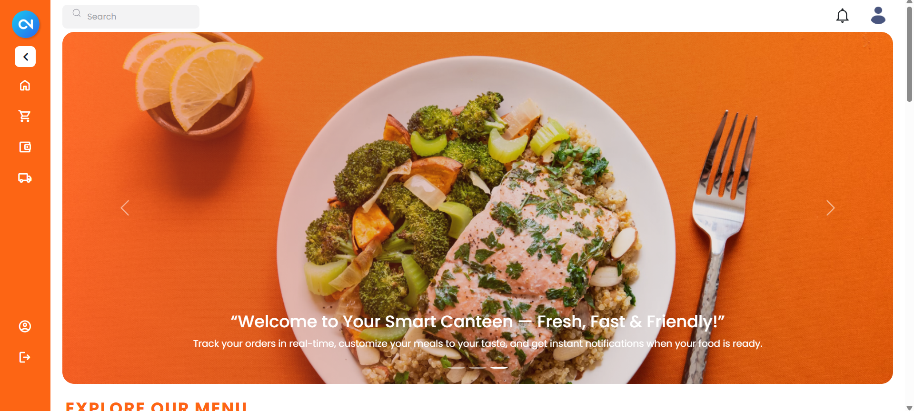
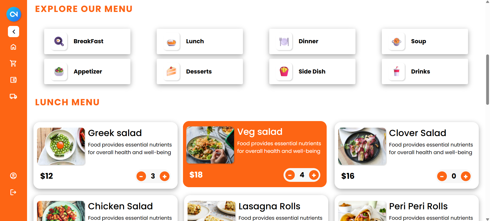
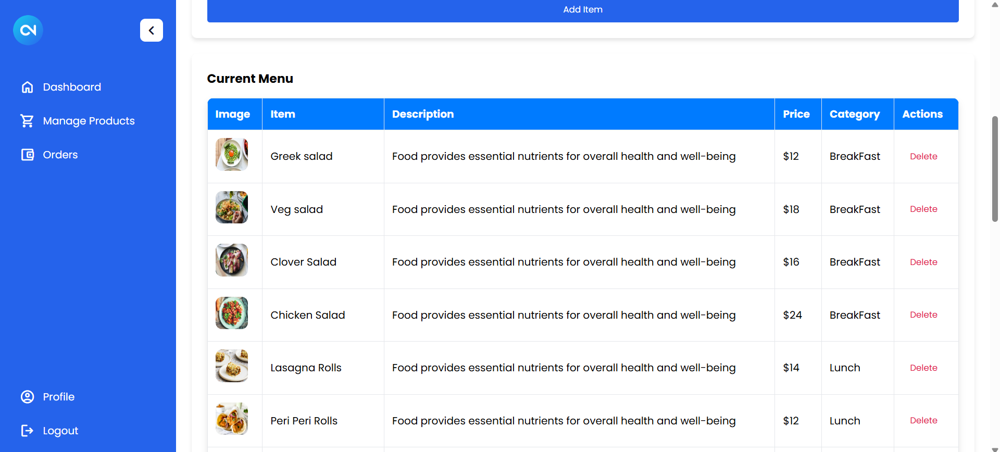

# 🍽️ Canteen Management System

A full-featured web-based application designed to streamline food ordering, menu updates, inventory management, and payment tracking in a canteen setting.

---

## 🔗 Live Demo
> [👉 Visit the Website](https://canteen-website-frontend-19fp.vercel.app/)  
> [📂 GitHub Repository](https://github.com/salmanz64/Canteen_Website)

---

## 📸 Screenshots

### 🔹 Home Page


### 🔹 Menu & Ordering


### 🔹 Admin Dashboard



## 🛠️ Tech Stack

**Frontend:**
- HTML, CSS, JavaScript
- React.js

**Backend:**
- Node.js
- Express.js

**Database:**
- MongoDB

**Others:**
- Git & GitHub
- Insomnia (for API testing)
- Vercel (for deployment)

---

## 📦 Features

### ✅ User Panel
- View menu and categories
- Place orders with item quantity
- View order history and payment summary

### ✅ Admin Panel
- Add, edit, or delete menu items
- Track inventory and monitor sales
- Update order status (processing, completed, etc.)

### ✅ General
- Responsive design (mobile + desktop)
- Real-time updates for menu/orders
- Clean and intuitive UI

---

## 🚀 Getting Started

### 1. Clone the repository
```bash
git clone https://github.com/salmanz64/Canteen_Website.git
cd Canteen_Website
